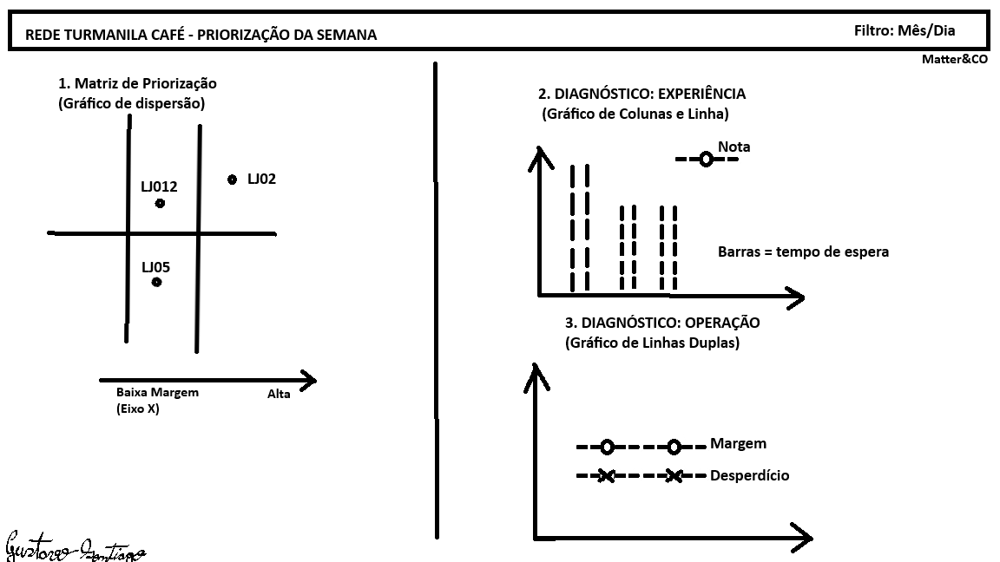

### 1. Usuária e momento do uso, com as premissas assumidas

**Nome: Marina Salles
Cargo: Diretora de Operações**
> Lê números bem mas não tem tempo para explorar dados crus

**Momento de Uso:** Segunda-feira de manhã, antes da reunião com os 5 gerentes regionais.

**Premissas assumidas:** Como a reunião envolve 5 gerentes e a capacidade de intervenção é de apenas 2 lojas por semana, a premissa é que a Mariana tem no máximo 10 a 15 minutos para olhar o painel. O sistema não pode ser um repositório de exploração; ele precisa ser uma ferramenta de priorização. Assumo que o foco será no curto prazo(últimos 30 a 60 dias) para tomada de decisões táticas

### 2.  Perguntas que o sistema atende

- Pergunta 1 - Quais são as duas lojas com pior desempenho combinado (financeiro + satisfação do cliente) que precisam da intervenção da semana?

- Pergunta 2 - Nas lojas priorizadas, a alavanca a ser puxada é operacional (alto índice de desperdício/custo de insumos) ou de experiência (tempo de espera/avaliações baixas)?

**O Motivo do Recorte:** O escopo de "Expansão" (abrir novas lojas) e "Equipe" (Revisar estrutura da equipe) foram deixados de fora. A justificativa é a restrição de capacidade técnica da empresa. Se a operação atual só consegue intervir em duas lojas por semana, o foco prioritário do conselho deve ser estancar as perdas da rede existente antes de alocar energia planejando novas aberturas ou investigar escalas evitando excesso de informações.

### 3. Mapa dos Dados

- **Origem:** A extração consiste em 4 arquivos CSV originais sem nenhum tratamento manual (turmalina_lojas.csv, turmalina_vendas_diarias.csv, turmalina_itens.csv e turmalina_avaliacoes.csv).  

- **Tratamento (Pipeline):** A ingestão e limpeza serão feitas via script Python utilizando Pandas. O tratamento incluirá: 
  - **Ajuste de tipografia:** Remoção de strings como "R$" e " m²" do arquivo de lojas e conversão forçada para ponto flutuante. 

  - **Tratamento de Texto Livre:** Mapeamento condicional na coluna nota das avaliações para converter textos como "três" e "4 estrelas" em valores numéricos inteiros.  

  - **Tratamento de Outliers e Nulos:** Remoção de falhas de travamento no totem das avaliações (ex: exclusão da trava de 999.0 na coluna tempo_espera_min) e imputação dos custos unitários ausentes no arquivo de itens.

  - **Validação de tipos:** Processo de conversão, validação e padronização dos formatos de entrada (como int, strings, float e datas) para garantir a integridade estrutural das informações. ex:Previnir falhas de processamento

  - **Destino:** Arquivos CSV estruturados em um modelo Star Schema (com tabela calendário e conectores de ID padronizados), alocados na pasta /data/processed, prontos para consumo no Power BI.

### 4. Dicionário de Indicadores

Metricas para guiar a priorização da semana na reunião de diretoria:

**1. Margem sobre Insumos (%)**
- Fórmula: (faturamento_bruto - custo_insumos - valor_desperdicio) / faturamento_bruto
- Pergunta Atendida: A loja consegue manter rentabilidade frente aos seus custos operacionais diários?
- Limitações: O cálculo extraído do PDV não contempla custos fixos e aluguel, pois não há sustentação destes dados nos arquivos originais.  

**2. Índice de Desperdício (%)**

- Fórmula: valor_desperdicio / faturamento_bruto
- Pergunta Atendida: A compressão da margem operacional é causada por ineficiência na manipulação diária de produtos?

**3. Tempo Médio de Espera (min)**

- Fórmula: Média da coluna tempo_espera_min (filtrada)
- Pergunta Atendida: A operação da loja está comprometendo a agilidade e a experiência do cliente?
- Limitações: A métrica exige filtragem severa de valores extremos devido a travamentos já mapeados no totem.  

**4. Nota de Satisfação**

- Fórmula: Média aritmética da coluna nota (após tratamento de texto)

- Pergunta Atendida: Como o cliente avalia o conjunto da obra daquela loja?

- Limitações: Inconsistência de preenchimento devido a versões antigas do aplicativo que aceitavam texto livre.  

### 5. Wireframe da Tela

- Filtro Global (Topo): Seleção de período (Mês/Semana) aplicável a todas as visões.

- Visão 1: Matriz de Priorização (Lado Esquerdo): Um Gráfico de Dispersão listando todas as lojas. O Eixo X exibe a Margem (%) e o Eixo Y a Nota de Satisfação. Este visual divide a tela e evidencia imediatamente as lojas na parte inferior esquerda (pior desempenho combinado).

- Visão 2: Diagnóstico de Experiência (Lado Direito, Superior): Um Gráfico de Colunas e Linha cruzando o Tempo Médio de Espera (barras) contra a evolução da Nota de Satisfação (linha).

- Visão 3: Diagnóstico Operacional (Lado Direito, Inferior): Um Gráfico de Linhas cruzando a evolução diária da Margem (%) contra picos no Índice de Desperdício (%)

### 6. Alternativas Descartadas e Justificativas

- O que ficou de fora: Indicadores de "Expansão" (abertura de novas unidades) e "Equipe" (Revisão de quadro e escalas).

- O motivo: A empresa possui capacidade restrita para realizar intervenções efetivas em, no máximo, duas lojas por semana.  

- A estratégia adotada: Optou-se por focar exclusivamente no diagnóstico de prioridades críticas(estancar vazamento de margem e contornar a insatisfação crítica dos clientes na rede atual). O painel direciona a capacidade de intervenção, postergando discussões de longo prazo, como expansão e eficiência de escala humana.  

